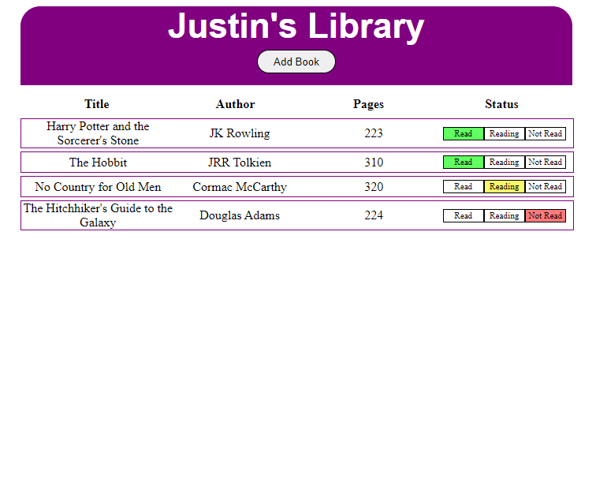

## To-Do List
App to organize a list of books you've read and plan to read.

🔗 **Live preview** of the app is [here](https://j-haze.github.io/library/).

### Purpose: ###
Create a "Library" that contains a list of the books that you want to read. The app shows off my ability to create a functional application using JavaScript.

### Features: ###

* Add or delete books from your library
* Local Storage saves your books to your browser 
* Toggle reading status of books between: "Read", "Reading", and "Not Read"

### Built With: ###

* HTML/CSS
* JavaScript
* Webpack
* Local Storage

### Picture: ###

